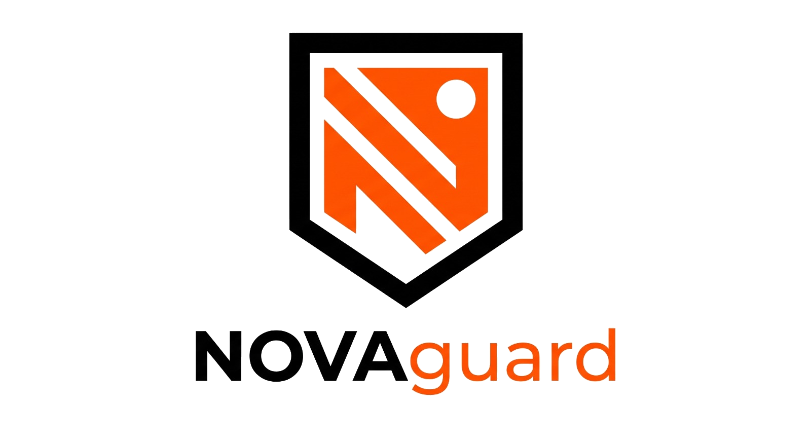

<div align="center">



# NOVAguard

### *Neutralizing Localized Social Engineering — Fortifying Economic Resilience and Restoring Digital Trust in Sri Lanka*

---

[](https://www.apicta.org)
[](#testing)
[](https://python.org)
[](https://fastapi.tiangolo.com)
[](https://reactjs.org)
[](https://langchain.com)
[](LICENSE)

---

### 🏆 APICTA 2026 National Competition — Category 3: Innovative Application of Technology
#### Team OmniSyntax · Sri Lanka Institute of Information Technology (SLIIT)

---

**🛡️ Sri Lanka's first AI-powered, multi-modal scam and spoofing detection platform.**
*Agentic LLM investigation · BEC prevention · QR quishing detection · National threat sharing.*

<br/>

| 📊 Metric | 📈 Value | 🔬 Source |
|:---:|:---:|:---:|
| **Scam Detection Rate** | **100%** | CERT.LK Evaluation Dataset |
| **False Positive Rate** | **0%** | 10-sample ablation-verified run |
| **Risk Score Correlation** | **0.9395 Pearson** | vs. Human expert ground truth |
| **Unit Tests Passing** | **59 / 60** | pytest — 3 Phase 2 modules |
| **Median Analysis Time** | **10.3 seconds** | Live evaluation run |
| **Lines of Code** | **~14,000** | 67 Python + 21 JSX files |

<br/>

[🚀 Quick Start](#-quick-start-5-minutes) · [📖 Full Setup](#-detailed-installation) · [🔌 API Docs](#-api-reference) · [🧪 Run Tests](#-running-tests) · [📊 Evaluation](#-evaluation-harness) · [🏗️ Architecture](#-system-architecture)

</div>

---

## 📋 Table of Contents

- [What Is NovaGuard?](#-what-is-novaguard)
- [Sri Lanka Threat Landscape](#-sri-lanka-threat-landscape)
- [System Architecture](#-system-architecture)
- [Feature Highlights](#-feature-highlights)
- [Technology Stack](#-technology-stack)
- [Prerequisites](#-prerequisites)
- [Quick Start (5 Minutes)](#-quick-start-5-minutes)
- [Detailed Installation](#-detailed-installation)
  - [Linux / Ubuntu](#linuxubuntu-recommended)
  - [macOS](#macos)
  - [Windows](#windows)
- [Environment Configuration](#-environment-configuration)
  - [LLM Provider Setup](#llm-provider-setup-choose-one)
- [Running the System](#-running-the-system)
  - [Option A — Full Stack (Recommended)](#option-a--full-stack-recommended)
  - [Option B — Backend API Only](#option-b--backend-api-only)
  - [Option C — Frontend Only](#option-c--frontend-only)
  - [Option D — Telegram Bot](#option-d--telegram-bot)
  - [Option E — Legacy Streamlit](#option-e--legacy-streamlit-app)
- [API Reference](#-api-reference)
- [Postman Collection](#-postman-collection)
- [Evaluation Harness](#-evaluation-harness)
- [Running Tests](#-running-tests)
- [Project Structure](#-project-structure)
- [Troubleshooting](#-troubleshooting)
- [Team](#-team)
- [Research & Citation](#-research--citation)
- [License](#-license)

---

## 🧠 What Is NovaGuard?

NovaGuard is a production-ready, AI-powered cybersecurity platform built specifically for Sri Lanka. It detects scams, phishing attacks, Business Email Compromise (BEC), and QR quishing through an autonomous **LangChain ReAct agent** that selects its own investigation tools — real-time Selenium browsing, RDAP/DNS lookups, and VirusTotal scanning — before generating a structured threat verdict.

Unlike rule-based systems, NovaGuard does not match patterns. It **investigates** — the same way a human security analyst would, but in 10 seconds instead of 40 minutes.

### What Makes It Different

| Capability | NovaGuard | Every Other Tool in Sri Lanka |
|---|:---:|:---:|
| Autonomous multi-tool AI investigation | ✅ | ❌ |
| Live sandboxed URL browsing (Selenium) | ✅ | ❌ |
| QR quishing detection (4-layer pipeline) | ✅ | ❌ |
| Physical QR swap attack detection | ✅ | ❌ (no known implementation anywhere) |
| BEC email authentication (SPF/DKIM/DMARC) | ✅ | ❌ |
| Sri Lankan scam patterns in AI reasoning | ✅ | ❌ |
| Multi-provider LLM (NVIDIA · SambaNova · Groq · Gemini) | ✅ | — |
| Ablation-verified tool contribution | ✅ | — |
| CERT.LK-calibrated ground truth dataset | ✅ | — |

---

## 🇱🇰 Sri Lanka Threat Landscape

Sri Lanka faces an accelerating digital fraud crisis with **zero automated defence** at any level:

| Attack Vector | Frequency | Current Protection |
|---|---|---|
| **Phishing / Smishing** (SMS, WhatsApp, Telegram) | Daily — high volume | None at consumer level |
| **Business Email Compromise (BEC)** | Weekly — targeted organisations | None — payloadless attacks bypass all tools |
| **QR Code Quishing** | Growing rapidly since 2024 | Zero — URL encoded as image, invisible to scanners |
| **Lookalike Domain Fraud** | Continuous — 100s/month | Manual CERT\|CC reporting only |
| **Payment Terminal QR Swap** | ATMs and retail — physical attack | None — no digital detection path exists |

> **Verified Context:** Business Email Compromise caused **USD 2.9 billion** in global losses in 2023 alone — more than ransomware and phishing combined. The average organisation takes **120 days** to detect a BEC intrusion because payloadless attacks contain no malware and trigger zero conventional security alerts. Sri Lanka's banking and government sectors face this threat daily with no automated protection.  
> *Sources: FBI IC3 Annual Report 2023 · IBM Cost of a Data Breach 2024*

---

## 🏗️ System Architecture

```
╔══════════════════════════════════════════════════════════════════════╗
║                    NOVAGUARD — 3-TIER PLATFORM                       ║
╠══════════════════════════════════════════════════════════════════════╣
║  CONSUMER TIER (Phase 1)          BUSINESS TIER (Phase 2)            ║
║  ┌────────────────────┐           ┌──────────────────────────┐       ║
║  │  React Dashboard   │           │    Shield Dashboard       │       ║
║  │  Telegram Bot      │           │    BEC Email Guardian     │       ║
║  │  Web Upload        │           │    Domain Watcher         │       ║
║  │  SMS / URL / Email │           │    Payment Hold Queue     │       ║
║  │  Screenshot        │           │    HMAC Webhook (SIEM)    │       ║
║  │  QR Code           │           │    QR Quishing Engine     │       ║
║  └─────────┬──────────┘           └──────────┬───────────────┘       ║
╠════════════╪═════════════════════════════════╪═══════════════════════╣
║            ▼                                 ▼                       ║
║  ┌─────────────────────────────────────────────────────────────┐     ║
║  │              FastAPI Backend  (/api/v1/*)                   │     ║
║  │   JWT Auth · Async SSE · SQLite · Pydantic Validation       │     ║
║  └──────────────────────────┬──────────────────────────────────┘     ║
║                             ▼                                        ║
║  ┌──────────────────────────────────────────────────────────────┐    ║
║  │           LANGCHAIN REACT AUTONOMOUS AGENT                   │    ║
║  │   Autonomously selects tools per investigation case          │    ║
║  │                                                              │    ║
║  │  ┌──────────┐  ┌──────────┐  ┌──────────┐  ┌────────────┐  │    ║
║  │  │ Selenium │  │ RDAP/DNS │  │VirusTotal│  │ Typosquat  │  │    ║
║  │  │Live Chrome│  │Domain Age│  │90+ Scans │  │Detector    │  │    ║
║  │  └──────────┘  └──────────┘  └──────────┘  └────────────┘  │    ║
║  └──────────────────────────┬───────────────────────────────────┘    ║
║                             ▼                                        ║
║  ┌──────────────────────────────────────────────────────────────┐    ║
║  │              MULTI-PROVIDER LLM ENGINE                       │    ║
║  │   NVIDIA NIM · SambaNova · Groq · Gemini (selectable)       │    ║
║  │   Vision: LLaMA 3.2-11B Vision (NVIDIA NIM)                 │    ║
║  └──────────────────────────────────────────────────────────────┘    ║
╠══════════════════════════════════════════════════════════════════════╣
║   VERDICT:  🔴 DANGEROUS (70–100)  🟡 SUSPICIOUS (31–69)  🟢 SAFE (0–30) ║
╚══════════════════════════════════════════════════════════════════════╝
```

### Investigation Pipeline

```
User Input ──► FastAPI ──► LangChain ReAct Agent ──► Tool Selection
(text/URL/              (/api/v1/investigate)         (autonomous)
 email/QR/                                                │
 screenshot)                                             ▼
                                            ┌─── Selenium Live Browse
                                            ├─── RDAP Domain Age
                                            ├─── VirusTotal 90+ Scan
                                            ├─── SSL Certificate Check
                                            └─── Typosquat Detection
                                                         │
                                                         ▼
                                              LLM Reasoning + Scoring
                                                         │
                                                         ▼
                                         Verdict: Label + Score + Evidence
                                                         │
                                                         ▼
                                              SQLite Audit Log ──► SSE Stream
```

### QR Quishing — 4-Layer Detection Pipeline

```
QR Image Input
     │
     ▼
LAYER 1 ─ STRUCTURAL (< 50ms, zero API calls)
     │    URL shortener · Non-HTTPS flag · Suspicious TLD
     │    IP-as-host · Phishing path patterns
     │
     ▼  (score > 0)
LAYER 2 ─ ENRICHMENT (WHOIS · VirusTotal · URLScan)
     │    Domain registration age · 90+ engine reputation scan
     │    SSL certificate age · Live screenshot
     │
     ▼  (combined score > 0)
LAYER 3 ─ VISUAL CONTEXT (pytesseract OCR · Pillow pixel analysis)
     │    OCR label text vs decoded URL mismatch
     │    Overlay pixel variance ──► physical swap attack detection
     │
     ▼  (combined score > 40)
LAYER 4 ─ LLM INTENT (LLaMA / DeepSeek / Gemini)
          Credential harvesting? Brand impersonation? Urgency tactics?
          Returns structured QuishingResult JSON

RESULT ──► Risk Score (0–100) · Risk Level (green/yellow/red) · Signals
```

---

## ✨ Feature Highlights

### Phase 1 — Consumer Investigation Platform

| Feature | Description | Status |
|---|---|:---:|
| **Text / URL Investigation** | Paste any SMS, WhatsApp, or web link for full AI investigation using RDAP, SSL, typosquat, and Selenium tools | ✅ Live |
| **Email Analysis** | Sender + Subject + Body analysis with LLM header inspection | ✅ Live |
| **Screenshot Upload** | PNG/JPG/WEBP up to 10 MB — NVIDIA Vision extracts URLs and analyses scam patterns | ✅ Live |
| **Live Chrome Sandbox** | Every suspicious URL opens in an isolated Chrome tab — user sees the live page while AI analyses it | ✅ Live |
| **Investigation History** | Every verdict stored with timestamp, risk score, badge, and full report — accessible via History page | ✅ Live |
| **Telegram Bot** | Forward any suspicious text, URL, photo, or PDF — bot analyses and replies with verdict and evidence | ✅ Live |
| **Human Feedback Loop** | Users correct wrong verdicts — logged (SHA-256 hashed) to build real-world evaluation data | ✅ Live |
| **Result Caching** | SHA-256 keyed TTL cache (500 entries, 1 hour) — repeated submissions return instantly | ✅ Live |
| **Rate Limiting** | 5 requests per 60 seconds per user (Telegram bot) — abuse prevention | ✅ Live |

### Phase 2 — Shield Business Spoofing Prevention

| Feature | Description | Status |
|---|---|:---:|
| **Email Auth Engine** | SPF · DKIM · DMARC · Return-Path · Reply-To · Display-name check on every inbound email | ✅ Live |
| **BEC Payment Guardian** | Fast regex pre-filter (IBAN/SWIFT) → LLM intent analysis only when signals found | ✅ Live |
| **Domain Watcher** | Certificate transparency monitoring + brand lookalike detection | ✅ Live |
| **Payment Hold Queue** | Dual-approval enforcement — suspicious payments held pending human review | ✅ Live |
| **HMAC-SHA256 Webhooks** | Signed payloads to any SIEM (Splunk, Elastic, QRadar) | ✅ Live |
| **Shield SSE Alert Bus** | Real-time Server-Sent Events alert stream per organisation | ✅ Live |
| **QR Quishing Detection** | 4-layer pipeline across 5 input channels (web · email · Telegram · PDF · URL) | ✅ Live |
| **Physical QR Swap Detection** | Pixel variance analysis detects sticker-over-code attacks on ATMs | ✅ Live |
| **Takedown Bot** | Automated registrar abuse report filing | ✅ Architecture |

### Risk Verdict System

```
┌─────────────────┐  ┌─────────────────────┐  ┌─────────────────────────┐
│      SAFE       │  │     SUSPICIOUS       │  │       DANGEROUS         │
│   Risk 0–30     │  │     Risk 31–69       │  │       Risk 70–100       │
│ 🟢              │  │ 🟡                   │  │ 🔴                      │
│ No threats      │  │ Exercise caution.    │  │ Do not interact.        │
│ detected.       │  │ Verify before        │  │ Strong scam signals     │
│ Content appears │  │ acting.              │  │ found.                  │
│ legitimate.     │  │                      │  │                         │
└─────────────────┘  └─────────────────────┘  └─────────────────────────┘
```

---

## 🔧 Technology Stack

| Layer | Technology | Version | Purpose |
|---|---|---|---|
| **AI Reasoning** | LangChain ReAct | `langchain==0.3.25` | Autonomous multi-tool agent — selects tools per investigation |
| **LLM (Primary)** | NVIDIA NIM (DeepSeek V4 Pro) | `deepseek-ai/deepseek-v4-pro` | Threat intent reasoning and verdict generation |
| **LLM (Alt 1)** | SambaNova — LLaMA 3.3 70B | `Meta-Llama-3.3-70B-Instruct` | High-accuracy open-source inference |
| **LLM (Alt 2)** | Groq — LLaMA 3.3 70B | `llama-3.3-70b-versatile` | Fast free-tier inference |
| **LLM (Alt 3)** | Google Gemini 2.0 Flash | `gemini-2.0-flash` | Default evaluation provider |
| **Vision / OCR** | LLaMA 3.2-11B Vision (NVIDIA NIM) | `meta/llama-3.2-11b-vision-instruct` | Screenshot text extraction and analysis |
| **Backend API** | FastAPI + Uvicorn | `fastapi==0.115.6` | REST + SSE endpoints, JWT auth, `/api/v1` prefix |
| **Database** | SQLAlchemy + SQLite | `sqlalchemy>=2.0.0` | Investigation history, Shield alerts, user management |
| **Frontend** | React + Vite + Tailwind CSS | `vite==5.4.0` | Web dashboard at `localhost:5173` |
| **Live URL Sandbox** | Selenium WebDriver | `selenium==4.27.1` | Opens URLs in real isolated Chrome tab |
| **QR Decode** | pyzbar + pytesseract | `pyzbar>=0.1.9` | Image QR decode + OCR label text extraction |
| **PDF Scanning** | PyMuPDF (fitz) | `pymupdf>=1.24.0` | Extract images from PDFs, run QR decode on each |
| **Email Auth** | dnspython + dkimpy | `dnspython>=2.4.0` | SPF, DKIM, DMARC, header chain analysis |
| **Authentication** | python-jose + passlib | `python-jose>=3.3.0` | JWT Bearer tokens, bcrypt password hashing |
| **Mobile Access** | python-telegram-bot | `python-telegram-bot==21.9` | Telegram bot for text, photo, and PDF scanning |
| **Caching** | cachetools TTLCache | `cachetools>=5.3.0` | 500-entry, 1-hour TTL result cache |
| **Rate Limiting** | Custom sliding window | Built-in | 5 requests/60 seconds per user |

---

## 📋 Prerequisites

### All Platforms

| Requirement | Minimum Version | Download |
|---|---|---|
| **Python** | 3.10+ | [python.org](https://www.python.org/downloads/) |
| **Node.js** | 18+ (for React frontend) | [nodejs.org](https://nodejs.org/) |
| **Google Chrome** | Latest stable | [chrome.google.com](https://www.google.com/chrome/) |
| **Git** | Any recent version | [git-scm.com](https://git-scm.com/) |

### API Keys Required

| Key | Required | Where to Get | Cost |
|---|---|---|---|
| **NVIDIA API Key** *(recommended)* | For NVIDIA NIM provider | [build.nvidia.com](https://build.nvidia.com/) | Free credits available |
| **Google API Key** | For Gemini provider + Vision OCR | [aistudio.google.com](https://aistudio.google.com/) | Free tier available |
| **Groq API Key** | For Groq provider | [console.groq.com](https://console.groq.com/) | Free tier |
| **SambaNova API Key** | For SambaNova provider | [cloud.sambanova.ai](https://cloud.sambanova.ai/) | Free tier |
| **Telegram Bot Token** | Optional — for Telegram bot | [@BotFather](https://t.me/BotFather) on Telegram | Free |
| **VirusTotal API Key** | Optional — for URL reputation | [virustotal.com](https://www.virustotal.com/) | Free tier (500 req/day) |
| **URLScan API Key** | Optional — for live screenshots | [urlscan.io](https://urlscan.io/) | Free tier |

> **Minimum to run core system:** One LLM provider key (NVIDIA recommended) + Google API key for Vision.  
> All other keys unlock additional features but are not required to start.

### System Packages (Platform-Specific)

See the [Detailed Installation](#-detailed-installation) section for your platform.

---

## 🚀 Quick Start (5 Minutes)

For experienced developers who want to get NovaGuard running immediately.

```bash
# 1. Clone and enter the project
git clone <your-repo-url> novaguard && cd novaguard

# 2. Create virtual environment and install dependencies
python -m venv .venv
source .venv/bin/activate          # Windows: .venv\Scripts\activate
pip install -r requirements.txt

# 3. Configure environment
cp .env.example .env
# Open .env and add your NVIDIA_API_KEY (or GOOGLE_API_KEY for Gemini)
# Set GOOGLE_API_KEY for Vision OCR (required for screenshots)

# 4. Start the backend
python run_backend.py
# → API running at http://localhost:8000
# → Swagger docs at http://localhost:8000/docs

# 5. Start the frontend (new terminal)
cd frontend && npm install && npm run dev
# → Dashboard at http://localhost:5173
```

> **For a quick test without the frontend:** Use the Swagger UI at `http://localhost:8000/docs` to submit your first investigation via the browser.

---

## 📦 Detailed Installation

### Linux/Ubuntu *(Recommended)*

#### Step 1 — Install System Dependencies

```bash
# Update package list
sudo apt update

# Install system dependencies for QR scanning and OCR
sudo apt install -y \
    libzbar0 \
    libzbar-dev \
    tesseract-ocr \
    libtesseract-dev \
    tesseract-ocr-eng \
    python3-pip \
    python3-venv \
    git

# Verify installations
tesseract --version      # should show 4.x or 5.x
python3 --version        # should show 3.10+
```

#### Step 2 — Install Google Chrome

```bash
# Download and install Chrome
wget -q -O - https://dl.google.com/linux/linux_signing_key.pub | sudo apt-key add -
sudo sh -c 'echo "deb [arch=amd64] http://dl.google.com/linux/chrome/deb/ stable main" > /etc/apt/sources.list.d/google-chrome.list'
sudo apt update && sudo apt install -y google-chrome-stable

# Verify
google-chrome --version
```

> **Note:** ChromeDriver is managed automatically by `webdriver-manager` — no manual download needed.

#### Step 3 — Install Node.js (for React Frontend)

```bash
# Install Node.js 18+ via NodeSource
curl -fsSL https://deb.nodesource.com/setup_18.x | sudo -E bash -
sudo apt install -y nodejs

# Verify
node --version    # should show v18.x or higher
npm --version
```

#### Step 4 — Clone and Set Up Python Environment

```bash
# Clone the repository
git clone <your-repo-url> novaguard
cd novaguard

# Create and activate virtual environment
python3 -m venv .venv
source .venv/bin/activate

# Verify you are in the virtual environment
which python   # should show path inside .venv

# Install Python dependencies
pip install --upgrade pip
pip install -r requirements.txt

# (Optional) Install evaluation dependencies
pip install -r requirements-eval.txt
```

#### Step 5 — Set Up the Frontend

```bash
cd frontend
npm install
cd ..   # return to project root
```

#### Step 6 — Configure Environment Variables

```bash
cp .env.example .env
nano .env   # or: code .env  /  vim .env
```

See [Environment Configuration](#-environment-configuration) for all options.

---

### macOS

#### Step 1 — Install Homebrew (if not already installed)

```bash
/bin/bash -c "$(curl -fsSL https://raw.githubusercontent.com/Homebrew/install/HEAD/install.sh)"
```

#### Step 2 — Install System Dependencies

```bash
# Install required packages
brew install zbar tesseract node python@3.11

# Install Google Chrome (if not already installed)
brew install --cask google-chrome

# Verify
tesseract --version
python3 --version
node --version
```

#### Step 3 — Clone and Set Up

```bash
git clone <your-repo-url> novaguard
cd novaguard

# Python virtual environment
python3 -m venv .venv
source .venv/bin/activate

pip install --upgrade pip
pip install -r requirements.txt
pip install -r requirements-eval.txt   # optional

# Frontend
cd frontend && npm install && cd ..

# Environment
cp .env.example .env
open -e .env   # opens in TextEdit
```

---

### Windows

#### Step 1 — Install Prerequisites

1. **Python 3.10+**  
   Download from [python.org](https://www.python.org/downloads/windows/)  
   ✅ Check **"Add Python to PATH"** during installation

2. **Node.js 18+**  
   Download from [nodejs.org](https://nodejs.org/)

3. **Google Chrome**  
   Download from [google.com/chrome](https://www.google.com/chrome/)

4. **Git**  
   Download from [git-scm.com](https://git-scm.com/)

#### Step 2 — Install Tesseract OCR (Windows)

Download the installer from: **[github.com/UB-Mannheim/tesseract/wiki](https://github.com/UB-Mannheim/tesseract/wiki)**

During installation:
- ✅ Install for all users
- Note the installation path (default: `C:\Program Files\Tesseract-OCR`)
- Add to PATH in System Environment Variables:
  ```
  C:\Program Files\Tesseract-OCR
  ```

Verify in a new terminal:
```cmd
tesseract --version
```

#### Step 3 — Install ZBar (Windows)

Download the ZBar installer from [sourceforge.net/projects/zbar/](https://sourceforge.net/projects/zbar/)  
Or install via pip (includes Windows binaries):
```cmd
pip install zbar-py
```

#### Step 4 — Clone and Set Up (PowerShell)

```powershell
# Clone repository
git clone <your-repo-url> novaguard
cd novaguard

# Create virtual environment
python -m venv .venv
.venv\Scripts\activate

# Install Python dependencies
pip install --upgrade pip
pip install -r requirements.txt
pip install -r requirements-eval.txt   # optional

# Frontend
cd frontend
npm install
cd ..

# Environment
copy .env.example .env
notepad .env
```

---

## ⚙️ Environment Configuration

Open `.env` and configure the following variables. The file is structured in sections:

### Required — Google API Key (Vision OCR)

```env
# Required for screenshot analysis and Vision tool
# Get free at: https://aistudio.google.com/
GOOGLE_API_KEY=your_google_api_key_here
```

### LLM Provider Setup (Choose One)

NovaGuard supports four LLM providers via a single factory (`agent/llm_factory.py`). Set `LLM_PROVIDER` to activate your choice.

---

#### ✅ Option 1 — NVIDIA NIM *(Recommended — Best Performance)*

```env
LLM_PROVIDER=nvidia
NVIDIA_API_KEY=your_nvidia_api_key_here
LLM_MODEL=deepseek-ai/deepseek-v4-pro
```

Get your key: [build.nvidia.com](https://build.nvidia.com/)  
Available models: `deepseek-ai/deepseek-v4-pro` · `deepseek-ai/deepseek-v4-flash` · `meta/llama-3.3-70b-instruct`

---

#### ✅ Option 2 — Groq Cloud *(Free Tier — Fast)*

```env
LLM_PROVIDER=groq
GROQ_API_KEY=your_groq_api_key_here
LLM_MODEL=llama-3.3-70b-versatile
```

Get your key: [console.groq.com](https://console.groq.com/)  
Available models: `llama-3.3-70b-versatile` · `llama3-70b-8192`

---

#### ✅ Option 3 — SambaNova Cloud *(LLaMA 3.3 70B)*

```env
LLM_PROVIDER=sambanova
SAMBANOVA_API_KEY=your_sambanova_key_here
SAMBANOVA_BASE_URL=https://api.sambanova.ai/v1
LLM_MODEL=Meta-Llama-3.3-70B-Instruct
```

Get your key: [cloud.sambanova.ai](https://cloud.sambanova.ai/)

---

#### ✅ Option 4 — Google Gemini *(Default Fallback)*

```env
LLM_PROVIDER=gemini
# GOOGLE_API_KEY is already set above — no extra key needed
LLM_MODEL=gemini-2.0-flash
```

---

### Optional Services

```env
# Telegram Bot — enables bot/novaguard_bot.py
TELEGRAM_BOT_TOKEN=your_telegram_bot_token_here

# VirusTotal — enables 90+ engine URL scanning
VIRUSTOTAL_API_KEY=your_virustotal_api_key_here

# URLScan.io — enables live website screenshot in reports
URLSCAN_API_KEY=your_urlscan_key_here
```

### Backend & Privacy Settings

```env
# API server settings
NOVAGUARD_API_URL=http://localhost:8000
NOVAGUARD_API_HOST=0.0.0.0
NOVAGUARD_API_PORT=8000

# Optional API key protection (leave empty for open access)
NOVAGUARD_API_KEY=

# JWT settings (change JWT_SECRET in production!)
# NOVAGUARD_JWT_SECRET=your-secret-key-here
# NOVAGUARD_JWT_EXPIRE_MINUTES=10080   # 7 days (default)

# Privacy mode — when true, no query content is written to disk
# Set to true for production / enterprise deployments
ZERO_RETENTION_MODE=false
```

### Complete `.env` Example (NVIDIA Setup)

```env
# === NOVAGUARD FULL CONFIGURATION ===

# Vision (always required)
GOOGLE_API_KEY=AIza...your_key_here

# Primary LLM — NVIDIA NIM
LLM_PROVIDER=nvidia
NVIDIA_API_KEY=nvapi-...your_key_here
LLM_MODEL=deepseek-ai/deepseek-v4-pro

# Optional services
TELEGRAM_BOT_TOKEN=7123456789:AAF...your_token
VIRUSTOTAL_API_KEY=your_vt_key_here
URLSCAN_API_KEY=your_urlscan_key_here

# Backend
NOVAGUARD_API_URL=http://localhost:8000
NOVAGUARD_API_HOST=0.0.0.0
NOVAGUARD_API_PORT=8000
ZERO_RETENTION_MODE=false
```

---

## ▶️ Running the System

### Option A — Full Stack *(Recommended)*

Run the backend and frontend concurrently in two separate terminals:

**Terminal 1 — Backend API**
```bash
# Ensure virtual environment is active
source .venv/bin/activate   # Windows: .venv\Scripts\activate

# Start the FastAPI backend
python run_backend.py
```

Expected output:
```
Starting NovaGuard API on http://0.0.0.0:8000
  Docs:    http://0.0.0.0:8000/docs
  Model:   gemini-2.5-pro
  X-API-Key required: False
INFO:     Uvicorn running on http://0.0.0.0:8000 (Press CTRL+C to quit)
```

**Terminal 2 — React Frontend**
```bash
cd frontend
npm run dev
```

Expected output:
```
  VITE v5.4.x  ready in 500ms
  ➜  Local:   http://localhost:5173/
  ➜  Network: http://192.168.x.x:5173/
```

**Access Points:**
| Service | URL |
|---|---|
| 🖥️ Web Dashboard | http://localhost:5173 |
| 📖 Swagger UI (API Docs) | http://localhost:8000/docs |
| 📋 ReDoc (API Reference) | http://localhost:8000/redoc |
| 🔍 Health Check | http://localhost:8000/api/v1/health |

---

### Option B — Backend API Only

For API-only usage (headless deployment, Postman testing, or CI):

```bash
source .venv/bin/activate

# Method 1 — Project shim (recommended)
python run_backend.py

# Method 2 — Direct Uvicorn with hot reload
uvicorn backend.main:app --reload --host 0.0.0.0 --port 8000

# Method 3 — Custom host/port
NOVAGUARD_API_HOST=127.0.0.1 NOVAGUARD_API_PORT=9000 python run_backend.py
```

**Verify the backend is running:**
```bash
curl http://localhost:8000/api/v1/health
# Expected: {"status":"ok","components":{...}}

curl http://localhost:8000/api/v1/version
# Expected: {"version":"1.0.0","model":"nvidia:deepseek-ai/deepseek-v4-pro",...}
```

**Submit your first investigation:**
```bash
curl -X POST http://localhost:8000/api/v1/investigate \
  -H "Content-Type: application/json" \
  -d '{"input": "URGENT: Your BOC account suspended. Verify PIN: http://boc-verify.xyz", "input_type_hint": "auto"}'
```

---

### Option C — Frontend Only

*(Use when backend is already running elsewhere)*

```bash
cd frontend
npm run dev        # development server with hot reload

# Or build for production:
npm run build      # outputs to frontend/dist/
npm run preview    # preview production build locally
```

---

### Option D — Telegram Bot

```bash
source .venv/bin/activate

# Ensure TELEGRAM_BOT_TOKEN is set in .env
# The bot connects directly to the NovaGuard agent — no backend required

python bot/novaguard_bot.py
```

Expected output:
```
2026-05-19 10:00:00 | INFO | novaguard.bot | Starting NovaGuard Telegram bot...
2026-05-19 10:00:01 | INFO | novaguard.bot | Bot started. Listening for messages...
```

**Bot Commands:**
| Command | Description |
|---|---|
| `/start` | Welcome message and usage instructions |
| *(send text)* | Investigate any SMS, WhatsApp message, or URL |
| *(send photo)* | Screenshot analysis — extracts URLs and analyses scam patterns |
| *(send document)* | PDF analysis — scans all pages for QR codes and malicious links |

> **Rate Limiting:** The bot enforces 5 requests per 60-second window per user to prevent abuse.

---

### Option E — Legacy Streamlit App

A simplified single-page interface for quick testing (no backend or Node.js required):

```bash
source .venv/bin/activate
streamlit run app.py
# Opens at http://localhost:8501
```

> ℹ️ The Streamlit app is the original Phase 1 prototype. The **React dashboard + FastAPI backend** (Options A/B/C) is the current production system with full Phase 2 capabilities.

---

### Warming Up the System

For production deployments, warm up the agent before serving traffic to avoid cold-start latency on the first request:

```bash
curl -X POST http://localhost:8000/api/v1/warmup
# Returns: {"ok":true,"agent_ready":true,"vision_ready":true,"latency_seconds":x.xxx}
```

---

## 📡 API Reference

All endpoints are prefixed with `/api/v1`. Full interactive documentation available at `http://localhost:8000/docs`.

### Meta Endpoints

| Method | Endpoint | Auth | Description |
|---|---|---|---|
| `GET` | `/api/v1/health` | None | System health and API key status |
| `GET` | `/api/v1/version` | None | Version, active LLM model, optional service status |
| `POST` | `/api/v1/warmup` | API Key | Pre-initialise agent + vision for faster first request |

### Authentication

| Method | Endpoint | Description |
|---|---|---|
| `POST` | `/api/v1/auth/register` | Register a new user account |
| `POST` | `/api/v1/auth/login` | Login and receive JWT Bearer token |
| `GET` | `/api/v1/auth/me` | Get current authenticated user details |

**Login Example:**
```bash
# Register
curl -X POST http://localhost:8000/api/v1/auth/register \
  -H "Content-Type: application/json" \
  -d '{"email":"user@example.com","username":"analyst","password":"securepass123"}'

# Login
curl -X POST http://localhost:8000/api/v1/auth/login \
  -H "Content-Type: application/json" \
  -d '{"email":"user@example.com","password":"securepass123"}'
# Returns: {"access_token":"eyJ...","token_type":"bearer"}
```

### Phase 1 — Investigation

| Method | Endpoint | Auth | Description |
|---|---|---|---|
| `POST` | `/api/v1/investigate` | Optional JWT | Submit text, URL, or pasted message for full AI investigation |
| `POST` | `/api/v1/investigate/email` | Optional JWT | Email analysis — sender, subject, body fields |
| `POST` | `/api/v1/investigate/screenshot` | Optional JWT | Upload PNG/JPG/WEBP screenshot (up to 10 MB) |
| `GET` | `/api/v1/history` | JWT Required | Retrieve investigation history with verdicts |
| `GET` | `/api/v1/spoofing/stream` | JWT Required | SSE stream — live Spoofing Watch threat broadcast |

**Investigation Request:**
```bash
# Text / URL investigation
curl -X POST http://localhost:8000/api/v1/investigate \
  -H "Content-Type: application/json" \
  -d '{
    "input": "Peoples Bank Notice: Suspicious login. Verify at https://peoples-bank-lk.com/secure",
    "input_type_hint": "auto"
  }'
```

**Response Schema:**
```json
{
  "predicted_label": "SCAM",
  "predicted_score": 90,
  "input_type": "url",
  "latency_seconds": 40.43,
  "traffic_light": "red",
  "traffic_light_label": "DANGEROUS",
  "recommended_action": "Do not visit the URL or enter any personal information.",
  "report": "## 🔍 NovaGuard Investigation Report\n**Verdict:** SCAM\n..."
}
```

**Email Investigation:**
```bash
curl -X POST http://localhost:8000/api/v1/investigate/email \
  -H "Content-Type: application/json" \
  -d '{
    "sender": "cfo@b0c-lk.xyz",
    "subject": "URGENT - New Bank Account Details",
    "body": "Please wire USD 150,000 to IBAN LK02000..."
  }'
```

**Screenshot Investigation:**
```bash
curl -X POST http://localhost:8000/api/v1/investigate/screenshot \
  -H "Authorization: Bearer eyJ..." \
  -F "file=@suspicious_screenshot.png"
```

### Feedback

| Method | Endpoint | Description |
|---|---|---|
| `POST` | `/api/v1/feedback` | Submit correction — `correct` or `incorrect` verdict |
| `GET` | `/api/v1/feedback/stats` | Feedback statistics for model improvement |
| `POST` | `/api/v1/feedback/export` | Export feedback as training dataset |

### Phase 2 — Shield

| Method | Endpoint | Auth | Description |
|---|---|---|---|
| `POST` | `/api/v1/shield/org/register` | JWT | Register organisation for Shield monitoring |
| `POST` | `/api/v1/shield/scan-email` | JWT | Full email auth scan (SPF + DKIM + DMARC + BEC analysis) |
| `POST` | `/api/v1/shield/payment/hold` | JWT | Hold flagged payment — fires HMAC-signed webhook |
| `GET` | `/api/v1/shield/payment/queue/{org_id}` | JWT | List pending payment holds |
| `GET` | `/api/v1/shield/alerts/{org_id}` | JWT | SSE stream — live Shield alerts per organisation |
| `GET` | `/api/v1/shield/org/{org_id}` | JWT | Organisation details and monitoring status |
| `GET` | `/api/v1/shield/domain/alerts/{org_id}` | JWT | Domain lookalike alerts |
| `POST` | `/api/v1/shield/domain/takedown` | JWT | Initiate automated registrar abuse report |

**Shield Email Scan:**
```bash
# Encode raw email as base64 first
EMAIL_B64=$(base64 -w 0 suspicious_email.eml)

curl -X POST http://localhost:8000/api/v1/shield/scan-email \
  -H "Authorization: Bearer eyJ..." \
  -H "Content-Type: application/json" \
  -d "{\"raw_email\": \"$EMAIL_B64\", \"org_id\": \"org_001\"}"
```

### Phase 2 — QR Quishing

| Method | Endpoint | Auth | Description |
|---|---|---|---|
| `POST` | `/api/v1/qr/scan` | Optional JWT | Upload image — QR decode + 4-layer quishing analysis |
| `POST` | `/api/v1/qr/scan-pdf` | Optional JWT | Upload PDF — extract + analyse all QR codes on every page |
| `POST` | `/api/v1/qr/scan-url` | Optional JWT | HTTPS image URL — decode + analyse (Telegram file links) |
| `GET` | `/api/v1/qr/history` | JWT | QR scan history stored as Investigation records |
| `GET` | `/api/v1/qr/report/{id}` | JWT | Full result for a single QR scan |

**QR Scan:**
```bash
# Image upload
curl -X POST http://localhost:8000/api/v1/qr/scan \
  -H "Authorization: Bearer eyJ..." \
  -F "file=@qr_code_image.png"

# PDF scan (extracts all QR codes from all pages)
curl -X POST http://localhost:8000/api/v1/qr/scan-pdf \
  -H "Authorization: Bearer eyJ..." \
  -F "file=@invoice_with_qr.pdf"
```

---

## 📮 Postman Collection

A complete Postman collection is included at:
```
postman/NovaGuard.postman_collection.json
```

**Import into Postman:**
1. Open Postman → **Import** → Select `postman/NovaGuard.postman_collection.json`
2. Set the `base_url` environment variable: `http://localhost:8000`
3. (Optional) Set `auth_token` after calling the Login endpoint

**Available Request Groups:**
- `Meta` — Health, Version, Warmup
- `Investigate` — Text, URL, Email, Screenshot investigations
- `Feedback` — Submit corrections and view stats

---

## 📊 Evaluation Harness

NovaGuard includes a full reproducible evaluation framework. This is what sets it apart from student projects — it has research-grade methodology built in.

### Ground Truth Dataset

The labelled dataset (`evaluation/dataset/ground_truth.json`) contains:

| Source | Type | Count |
|---|---|---|
| **CERT.LK-manual** | Sri Lankan scam SMS and URLs (manually curated from CERT.LK advisories) | 10 |
| **OpenPhish** | Verified active phishing URLs | 11 |
| **PhishTank** | Community-verified phishing URLs | 10 |
| **Total** | | **31 samples** (25 SCAM · 6 SAFE) |

### Running the Evaluation

```bash
source .venv/bin/activate
pip install -r requirements-eval.txt   # only needed once

# 1. Dry run — validates wiring, no API calls spent
python run_evaluation.py --dry-run

# 2. Text-only mode (10 CERT.LK samples — fast, minimal cost)
python run_evaluation.py --mode text-only

# 3. Full evaluation with all samples
python run_evaluation.py

# 4. Skip ablation study (faster, main metrics only)
python run_evaluation.py --skip-ablation

# 5. Limit to N samples for testing
python run_evaluation.py --limit 5
```

### Evaluation Results (19 May 2026 — CERT.LK Dataset)

```
┌─────────────────────────────────────────────────────────────────────┐
│              NOVAGUARD vs GEMINI DIRECT BASELINE                     │
├──────────────────────────────┬───────────────┬───────────────────────┤
│ Metric                       │ NovaGuard     │ Gemini Direct         │
│                              │ (LLM + Tools) │ (LLM Only, No Tools)  │
├──────────────────────────────┼───────────────┼───────────────────────┤
│ Scam Detection Rate          │ 100% (4/4)    │ 100% (4/4)            │
│ False Negative Rate          │ 0%            │ 0%                    │
│ False Positive Rate (SCAM)   │ 0%            │ 0%                    │
│ Risk Score Pearson r         │ 0.9395 ✓      │ 0.9002                │
│ Mean Absolute Error          │ 14.3 ✓        │ 19.1 (higher = worse) │
│ Median Latency               │ 10.3 seconds  │ 1.0 seconds           │
│ P95 Latency                  │ 32.3 seconds  │ 3.8 seconds           │
└──────────────────────────────┴───────────────┴───────────────────────┘
```

### Ablation Study Results

```
┌──────────────────────────────────────────────────────────────────────────┐
│                       ABLATION STUDY — TOOL CONTRIBUTION                 │
├───────────────────────────┬────────────────────┬──────────┬──────────────┤
│ Configuration             │ Description        │ Scam Det │ False Pos %  │
├───────────────────────────┼────────────────────┼──────────┼──────────────┤
│ ✅ Full System            │ LLM + all tools    │ 100%     │ 0%     ← BEST│
│ ❌ No Tool                │ Selenium removed   │ 100%     │ 16.67% ← BAD │
│ ❌ No Local SL Context    │ Generic LLM prompt │ 100%     │ 0%           │
│ ❌ No Red Flag Checklist  │ No explicit flags  │ 100%     │ 0%           │
│ ❌ No Structured Output   │ Free-form response │ 100%     │ 0%           │
└───────────────────────────┴────────────────────┴──────────┴──────────────┘

KEY FINDING: Removing Selenium raises false positive rate from 0% → 16.67%.
The tool-augmented agent is structurally essential, not cosmetic.
```

### Viewing Results

All evaluation outputs are saved to `results/`:
```
results/
├── novaguard_20260519T155807Z.json          # Full NovaGuard results
├── novaguard_20260519T155807Z.csv           # Tabular form
├── geminidirectbaseline_20260519T155824Z.json  # Baseline comparison
├── ablation_full_system_*.json              # Ablation configs
├── ablation_no_tool_*.json
├── ablation_no_local_context_*.json
├── ablation_impact_*.csv                   # Impact table
└── experiment_report_20260519T160112Z.json # Full summary report
```

---

## 🧪 Running Tests

### Unit Test Suite (Phase 2 Modules)

```bash
source .venv/bin/activate

# Run all tests
pytest tests/ -v

# Run specific test file
pytest tests/test_email_auth.py -v
pytest tests/test_qr_scanner.py -v
pytest tests/test_payment_guardian.py -v

# Run with coverage report
pip install pytest-cov
pytest tests/ --cov=tools --cov-report=term-missing -v

# Run with short output (CI mode)
pytest tests/ -q
```

### Expected Results

```
tests/test_email_auth.py    ✅  24 passed
tests/test_qr_scanner.py    ✅  15 passed, 1 skipped (requires optional qrcode lib)
tests/test_payment_guardian.py  ✅  20 passed

======================== 59 passed, 1 skipped in X.XXs ========================
```

> **The 1 skipped test** requires the optional `qrcode` library for generating synthetic QR images. This is not a failure — it is a graceful skip documented in the test file.

### What Is Tested

| Module | Tests | What's Covered |
|---|---|---|
| `tools/email_auth.py` | 24 tests | SPF/DKIM/DMARC checks, BEC email fixtures, display-name spoofing, clean email baseline, header chain analysis, executive impersonation |
| `tools/qr_scanner.py` | 15 tests + 1 skip | QR decode, image preprocessing, PDF scanning, overlay detection, OCR label extraction, malformed input handling |
| `tools/payment_guardian.py` | 20 tests | IBAN/SWIFT detection, urgency scoring, BEC keyword matching, allow/warn/hold/block action, empty input fallback |

---

## 📁 Project Structure

```
novaguard/
│
├── agent/                          ← AI agent layer
│   ├── llm_factory.py              ← Multi-provider LLM factory (NVIDIA/SambaNova/Groq/Gemini)
│   ├── novaguard_agent.py          ← LangChain ReAct agent with Sri Lankan system prompt
│   └── __init__.py
│
├── backend/                        ← FastAPI application
│   ├── main.py                     ← App factory, CORS, route registration
│   ├── database.py                 ← SQLAlchemy models (Investigation, User, ShieldOrg, ShieldAlert)
│   ├── dependencies.py             ← Agent/Vision DI, JWT auth dependencies
│   ├── schemas.py                  ← Pydantic request/response models
│   ├── shield_bus.py               ← In-memory SSE event bus for Shield alerts
│   ├── models/
│   │   └── shield.py               ← Shield ORM models (JSON-as-Text for SQLite compat)
│   └── routes/
│       ├── auth.py                 ← /auth/register · /auth/login · /auth/me
│       ├── investigate.py          ← /investigate · /investigate/email · /investigate/screenshot
│       ├── history.py              ← /history
│       ├── qr_scan.py              ← /qr/scan · /qr/scan-pdf · /qr/scan-url · /qr/history
│       ├── shield.py               ← /shield/* (all Phase 2 Shield endpoints)
│       ├── browse_live.py          ← /browse-live (Selenium iframe proxy)
│       ├── feedback.py             ← /feedback (human-in-the-loop corrections)
│       └── health.py               ← /health · /version · /warmup
│
├── tools/                          ← Investigation tool library
│   ├── selenium_tool.py            ← Headless Chrome sandbox (persistent driver)
│   ├── email_auth.py               ← SPF + DKIM + DMARC + header chain + display-name check
│   ├── payment_guardian.py         ← BEC regex pre-filter + LLM intent analysis
│   ├── qr_scanner.py               ← pyzbar decode + pytesseract OCR + PDF scan + overlay detect
│   ├── quishing_detector.py        ← 4-layer quishing pipeline (structural → enrichment → visual → LLM)
│   ├── domain_watcher.py           ← Certificate transparency + brand lookalike monitoring
│   ├── vision_tool.py              ← NVIDIA NIM Vision for screenshot analysis
│   └── __init__.py
│
├── bot/                            ← Telegram bot
│   ├── novaguard_bot.py            ← Main bot (text/photo/PDF handlers, rate limiting, emoji verdicts)
│   └── webhook_server.py           ← Optional webhook mode
│
├── tests/                          ← Unit test suite (59/60 passing)
│   ├── test_email_auth.py          ← 24 tests — email authentication engine
│   ├── test_qr_scanner.py          ← 16 tests — QR decode + overlay detection
│   └── test_payment_guardian.py    ← 20 tests — BEC payment guardian
│
├── evaluation/                     ← Reproducible evaluation harness
│   ├── dataset/
│   │   ├── ground_truth.json       ← 31 labelled samples (CERT.LK + OpenPhish + PhishTank)
│   │   └── collectors/             ← Data collectors (PhishTank, OpenPhish, UCI SMS, manual)
│   ├── metrics/
│   │   └── scorer.py               ← Accuracy, F1, Pearson, MAE, latency, cost metrics
│   ├── benchmarks/
│   │   ├── baseline_gemini_direct.py   ← Gemini Direct (no tools) baseline
│   │   ├── baseline_urlscan.py         ← URLScan API baseline
│   │   └── baseline_virustotal.py      ← VirusTotal API baseline
│   ├── experiments/
│   │   ├── experiment_runner.py    ← Full evaluation pipeline (NovaGuard + baselines + ablation)
│   │   ├── ablation_study.py       ← 5-configuration ablation (full/no-tool/no-context/no-flags/no-format)
│   │   └── simulation_runner.py    ← Simulation mode for headless environments
│   └── annotation/
│       ├── guidelines.md           ← 4-label annotation taxonomy with Sri Lankan examples
│       └── annotator.py            ← Inter-annotator agreement tooling
│
├── feedback/
│   └── feedback_manager.py         ← Human-in-the-loop correction logger (SHA-256 hashed)
│
├── frontend/                       ← React + Vite + Tailwind CSS dashboard
│   ├── src/
│   │   ├── App.jsx                 ← Root component with routing
│   │   ├── pages/
│   │   │   ├── Dashboard.jsx       ← Main investigation interface
│   │   │   ├── History.jsx         ← Investigation history with verdict badges
│   │   │   ├── QRScanner.jsx       ← QR quishing detection interface
│   │   │   ├── ShieldDashboard.jsx ← Phase 2 SOC interface
│   │   │   ├── Landing.jsx         ← Public landing page
│   │   │   ├── Login.jsx           ← Authentication
│   │   │   └── Register.jsx        ← User registration
│   │   ├── components/
│   │   │   ├── RiskMeter.jsx       ← Animated 0–100 risk bar
│   │   │   ├── TrafficLight.jsx    ← Red/Yellow/Green verdict badge
│   │   │   ├── ReportCard.jsx      ← Full investigation report renderer
│   │   │   ├── AlertCard.jsx       ← Shield alert notification
│   │   │   ├── LiveBrowserFrame.jsx ← Selenium sandbox live preview
│   │   │   ├── QRDropzone.jsx      ← Drag-and-drop QR image upload
│   │   │   ├── HistoryRow.jsx      ← Investigation history table row
│   │   │   ├── Navbar.jsx          ← Navigation with auth state
│   │   │   └── Spinner.jsx         ← Loading indicator
│   │   ├── api/                    ← Axios API client modules
│   │   └── context/
│   │       └── AuthContext.jsx     ← JWT auth state (React Context)
│   ├── public/                     ← Static assets (logo, favicon)
│   └── dist/                       ← Production build output
│
├── frontend-legacy/                ← Original Streamlit prototype
│   └── streamlit_app.py
│
├── logo/                           ← NovaGuard brand assets
├── postman/                        ← API test collection
│   └── NovaGuard.postman_collection.json
├── results/                        ← Evaluation output (JSON/CSV, gitignored)
├── logs/                           ← Runtime logs (gitignored)
├── reports/                        ← Generated figures (gitignored)
│
├── app.py                          ← Legacy Streamlit entry point
├── config.py                       ← Central configuration + credential loading
├── run_backend.py                  ← FastAPI launch shim
├── run_evaluation.py               ← Evaluation harness launch shim
├── run_data_collection.py          ← Ground truth data collection
├── requirements.txt                ← Runtime Python dependencies
├── requirements-eval.txt           ← Evaluation-only dependencies
├── .env.example                    ← Environment template
└── .gitignore                      ← Excludes .env, logs, results, chromedriver
```

---

## 🔧 Troubleshooting

### Chrome / Selenium Issues

**Error:** `WebDriverException: ChromeDriver not found`
```bash
# ChromeDriver is managed automatically by webdriver-manager
# If it fails, manually install:
pip install --upgrade webdriver-manager selenium

# On Linux, ensure Chrome is installed:
google-chrome --version
```

**Error:** `SessionNotCreatedException: Chrome failed to start`
```bash
# On Linux servers (no display), install Xvfb:
sudo apt install -y xvfb
export DISPLAY=:99
Xvfb :99 -screen 0 1280x720x24 &

# Or force headless mode (already enabled in SeleniumInspector by default)
```

---

### Tesseract / QR Scanner Issues

**Error:** `TesseractNotFoundError`
```bash
# Linux:
sudo apt install tesseract-ocr libtesseract-dev

# macOS:
brew install tesseract

# Windows:
# Download from https://github.com/UB-Mannheim/tesseract/wiki
# Add installation directory to PATH
```

**Error:** `ImportError: No module named 'pyzbar'`
```bash
# Linux (requires libzbar):
sudo apt install libzbar0 libzbar-dev
pip install pyzbar

# macOS:
brew install zbar
pip install pyzbar

# Windows:
pip install pyzbar  # includes Windows binaries
```

---

### LLM Provider Issues

**Error:** `NVIDIA_API_KEY is not set`
```bash
# Check your .env file:
cat .env | grep LLM_PROVIDER
cat .env | grep NVIDIA_API_KEY

# Ensure LLM_PROVIDER matches your configured key:
# LLM_PROVIDER=nvidia  → needs NVIDIA_API_KEY
# LLM_PROVIDER=groq    → needs GROQ_API_KEY
# LLM_PROVIDER=sambanova → needs SAMBANOVA_API_KEY
# LLM_PROVIDER=gemini  → needs GOOGLE_API_KEY
```

**Error:** `RateLimitError` from LLM provider
```bash
# Reduce concurrent investigations or switch to a different provider
# Groq and NVIDIA NIM both have generous free tiers
# Use --limit flag during evaluation: python run_evaluation.py --limit 3
```

---

### Backend Issues

**Error:** `Address already in use` (port 8000)
```bash
# Kill the process using port 8000:
# Linux/macOS:
lsof -ti :8000 | xargs kill -9

# Windows:
netstat -ano | findstr :8000
taskkill /PID <PID> /F

# Or change the port:
NOVAGUARD_API_PORT=8001 python run_backend.py
```

**Error:** `CORS error` in React frontend
```bash
# The backend allows localhost:5173 by default
# If running frontend on a different port, update backend/main.py:
# allow_origins=["http://localhost:YOUR_PORT", ...]
```

---

### Frontend Issues

**Error:** `npm install` fails
```bash
# Clear npm cache and retry:
npm cache clean --force
npm install

# Check Node.js version (must be 18+):
node --version
```

**Error:** `API requests failing` (frontend cannot reach backend)
```bash
# Ensure backend is running:
curl http://localhost:8000/api/v1/health

# Check vite.config.js proxy:
# The frontend proxies /api to http://localhost:8000 by default
```

---

## 👥 Team

<div align="center">

| Member | Role | Contributions |
|---|---|---|
| **R.M.N.S. Jayathilake** | AI Engineer & System Architect | LangChain ReAct agent · LLM factory · QR detection engine · Test suite · Evaluation harness |
| **K.H.A.M.M. Kumarasinghe** | Frontend Developer | React dashboard · All 21 JSX components · SSE integration · Shield SOC UI |
| **W.G.J. Perera** | Backend Developer | FastAPI API layer · JWT auth · SQLAlchemy models · HMAC webhooks · Selenium sandbox |
| **R.M. Wijenarayana** | Research & Documentation Lead | CERT.LK dataset curation · Annotation guidelines · Ablation study design · APICTA strategy |

**Institution:** Sri Lanka Institute of Information Technology (SLIIT)  
**Competition:** APICTA 2026 — Category 3: Innovative Application of Technology  
**Team Name:** OmniSyntax

</div>

---

## 🏆 Competition Recognition

<div align="center">

### APICTA 2026 — Asia Pacific ICT Alliance Awards
**Category 3: Innovative Application of Technology**

| Criterion | NovaGuard Achievement |
|---|---|
| **Innovation** | First QR quishing detection system in Sri Lanka; first physical QR swap attack detection with no known global prior art; ablation-verified tool-augmented AI agent |
| **Technical Excellence** | LangChain ReAct agent · 4-provider LLM abstraction · 4-layer quishing pipeline · STIX 2.1 architecture · 59/60 tests passing |
| **Social / Economic Impact** | Addresses USD 2.9B global BEC threat category with zero existing local protection; free consumer tier for all Sri Lankans |
| **Business Viability** | 4-tier commercial model (LKR 25K–200K+/month) · 3-year revenue projection to LKR 48M · Post-competition funding pathway identified |
| **Completeness** | Live production system · Reproducible evaluation harness · 14,000 lines of code · CERT.LK-calibrated dataset |

</div>

---

## 📚 Research & Citation

NovaGuard is part of an ongoing final-year research project on agentic scam detection for Sri Lankan users at SLIIT. The evaluation methodology and CERT.LK-manual dataset are original contributions to Sri Lankan cybersecurity research.

If you use NovaGuard, its evaluation framework, or the CERT.LK-manual dataset in academic work, please cite:

```bibtex
@software{novaguard2026,
  title     = {NovaGuard: An Agentic AI Platform for Scam and Spoofing Detection in Sri Lanka},
  author    = {Jayathilake, R.M.N.S. and Kumarasinghe, K.H.A.M.M. and Perera, W.G.J. and Wijenarayana, R.M.},
  year      = {2026},
  institution = {Sri Lanka Institute of Information Technology},
  note      = {APICTA 2026 — Category 3: Innovative Application of Technology},
  url       = {<repository-url>}
}
```

### References

| # | Citation |
|---|---|
| [1] | FBI IC3. (2024). *2023 Internet Crime Report*. U.S. DOJ. https://www.ic3.gov |
| [2] | IBM Security. (2024). *Cost of a Data Breach Report 2024*. https://www.ibm.com/reports/data-breach |
| [3] | CERT\|CC Sri Lanka. *Advisories*. https://www.cert.gov.lk |
| [4] | Verizon. (2024). *2024 Data Breach Investigations Report*. https://www.verizon.com/business/resources/reports/dbir/ |
| [5] | Proofpoint. (2024). *State of the Phish 2024*. https://www.proofpoint.com |
| [6] | OWASP Foundation. (2021). *OWASP Top Ten 2021*. https://owasp.org/Top10/ |
| [7] | OASIS CTI TC. (2021). *STIX Version 2.1*. https://docs.oasis-open.org/cti/stix/v2.1/ |
| [8] | IETF. (2018). *RFC 8446: TLS 1.3*. https://datatracker.ietf.org/doc/html/rfc8446 |
| [9] | Meta AI. (2024). *Meta Llama 3.1*. https://ai.meta.com/blog/meta-llama-3-1/ |
| [10] | LangChain AI. (2024). *LangChain Docs*. https://docs.langchain.com |
| [11] | FIRST. (2022). *TLP Version 2.0*. https://www.first.org/tlp/ |
| [12] | OpenPhish. *Active Phishing URLs*. https://openphish.com |
| [13] | PhishTank. *Phishing URL Database*. https://www.phishtank.com |

---

## 📄 License

```
MIT License

Copyright (c) 2026 Team OmniSyntax — SLIIT

Permission is hereby granted, free of charge, to any person obtaining a copy
of this software and associated documentation files (the "Software"), to deal
in the Software without restriction, including without limitation the rights
to use, copy, modify, merge, publish, distribute, sublicense, and/or sell
copies of the Software, and to permit persons to whom the Software is
furnished to do so, subject to the following conditions:

The above copyright notice and this permission notice shall be included in all
copies or substantial portions of the Software.

THE SOFTWARE IS PROVIDED "AS IS", WITHOUT WARRANTY OF ANY KIND, EXPRESS OR
IMPLIED, INCLUDING BUT NOT LIMITED TO THE WARRANTIES OF MERCHANTABILITY,
FITNESS FOR A PARTICULAR PURPOSE AND NONINFRINGEMENT. IN NO EVENT SHALL THE
AUTHORS OR COPYRIGHT HOLDERS BE LIABLE FOR ANY CLAIM, DAMAGES OR OTHER
LIABILITY, WHETHER IN AN ACTION OF CONTRACT, TORT OR OTHERWISE, ARISING FROM,
OUT OF OR IN CONNECTION WITH THE SOFTWARE OR THE USE OR OTHER DEALINGS IN THE
SOFTWARE.
```

---

<div align="center">

**Built with 🛡️ for Sri Lanka · APICTA 2026 · Team OmniSyntax · SLIIT**

*NovaGuard stands alone: agentic AI · five-modality detection · ablation-verified accuracy · CERT.LK-calibrated evaluation · engineered entirely for Sri Lanka.*

<br/>

[](https://www.apicta.org)
[](tests/)
[](evaluation/)
[](evaluation/)

</div>
